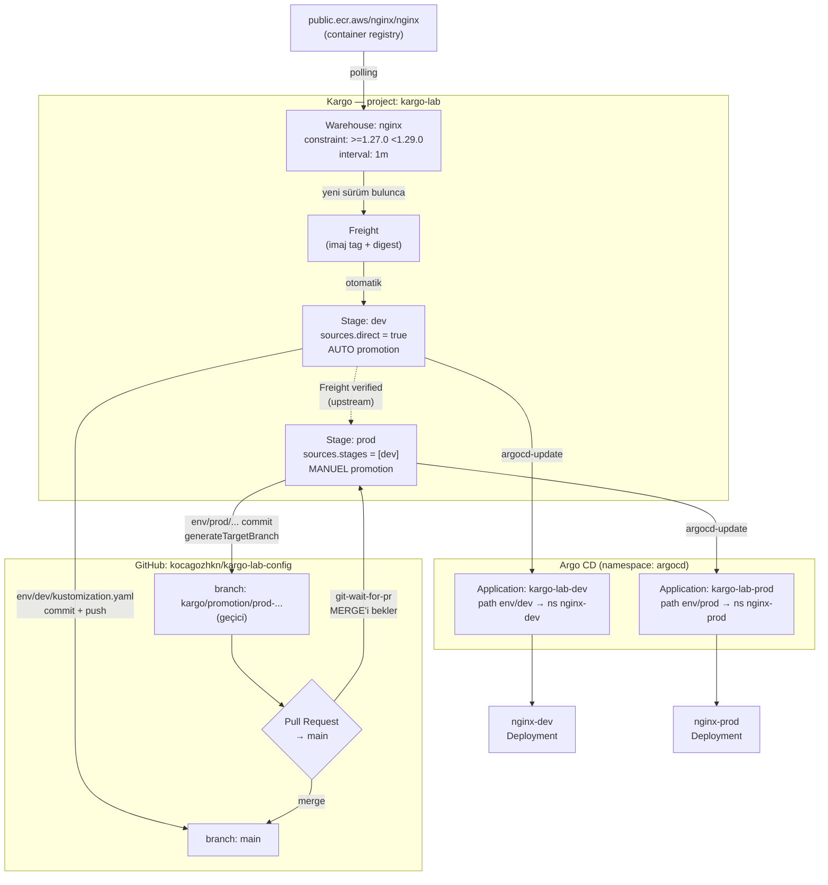

# Kargo Öğrenme Lab'i — Kurulum Rehberi

macOS + Colima + kind üzerinde **Kargo 1.11.2** + **Argo CD v3.5.1** ile
uçtan uca çalışan bir GitOps promotion pipeline'ı.

Bu doküman gerçekten kurulmuş ve çalıştırılmış bir lab'in kaydıdır — her komut
çalıştırıldı, her çıktı doğrulandı. Yol boyunca karşılaşılan **8 gerçek hata ve
teşhisi** [Bölüm 9](#9-tuzaklar-hatalar-ve-teşhisleri)'da.

---

## İçindekiler

| # | Bölüm |
|---|---|
| 1 | [Mimari](#1-mimari) |
| 2 | [Ön koşullar](#2-ön-koşullar) |
| 3 | [Kurulum](#3-kurulum) |
| 4 | [Config repo yapısı](#4-config-repo-yapısı) |
| 5 | [Kargo kaynakları](#5-kargo-kaynakları) |
| 6 | [Argo CD Applications](#6-argo-cd-applications) |
| 7 | [Doğrulama](#7-doğrulama) |
| 8 | [prod promotion akışı](#8-prod-promotion-akışı) |
| 9 | [Tuzaklar, hatalar ve teşhisleri](#9-tuzaklar-hatalar-ve-teşhisleri) |
| 10 | [Teşhis komutları](#10-teşhis-komutları) |
| 11 | [Güvenlik notları](#11-güvenlik-notları) |
| 12 | [Temizlik](#12-temizlik) |

---

## 1. Mimari

### Bileşenler

| Bileşen | Sürüm | Namespace | Notlar |
|---|---|---|---|
| Colima (Docker runtime) | — | — | 4 CPU / 8 GiB (minimum) |
| kind cluster `kargo-lab` | k8s v1.36.1 | — | tek control-plane node |
| cert-manager | v1.21.1 | `cert-manager` | Kargo ön koşulu (webhook sertifikaları) |
| Argo CD | chart 10.4.0 / app v3.5.1 | `argocd` | ClusterIP + port-forward, `admin/admin` |
| Kargo | chart & app 1.11.2 | `kargo` | ClusterIP + port-forward, `admin/admin` |
| Argo Rollouts | chart 2.41.1 / app v1.9.1 | `argo-rollouts` | verification'ın `AnalysisTemplate` CRD'lerini sağlar |
| Prometheus | chart 29.27.0 / app v3.14.0 | `monitoring` | minimal (yalnız server), verification'ın ölçüm kaynağı |
| Kargo Project | — | `kargo-lab` | Warehouse + 2 Stage + PromotionTask |
| İş yükü | nginx + exporter sidecar | `nginx-dev`, `nginx-prod` | `public.ecr.aws/nginx/nginx` + `nginx/nginx-prometheus-exporter:1.5.3` |

### Akış diyagramı



### Promotion adımları

| Stage | Adımlar |
|---|---|
| **dev** | `git-clone` → `kustomize-set-image` → `git-commit` → `git-push` (main) → `argocd-update` |
| **prod** | `git-clone` → `kustomize-set-image` → `git-commit` → `git-push` (`generateTargetBranch`) → `git-open-pr` → `git-wait-for-pr` → `argocd-update` |

**Tasarım kararı:** dev doğrudan `main`'e yazar (hızlı geri bildirim). prod ise
ayrı bir branch'e yazıp PR açar ve **PR merge edilene kadar bloke olur** — insan
onayı kapısı budur.

---

## 2. Ön koşullar

### Colima kaynakları

Kargo + Argo CD + cert-manager aynı node'da çalışacağı için **en az 4 CPU /
8 GiB** gerekir.

```bash
colima list                       # mevcut ayarı gör
colima start --cpu 4 --memory 8   # yoksa bu değerlerle başlat
```

> ⚠️ `colima start` flag'leri **kalıcıdır**: `--cpu 4 --memory 8` ile
> başlatırsan daha önce 8 CPU / 14 GiB olan VM kalıcı olarak küçülür. Artırmak
> için `colima stop && colima start --cpu 8 --memory 14`.

### Araçlar

```bash
brew install kind kubectl helm
brew install akuity/tap/kargo     # ⚠️ aşağıdaki sürüm notunu oku
```

> ### ⚠️ kargo CLI sürüm uyumu
>
> `akuity/tap` formülü **güncel olmayabilir**. Bu lab kurulurken tap `v1.0.3`
> veriyordu ama en yeni chart **1.11.2** idi — 11 minor sürüm fark. CLI ile
> server arasında bu kadar açık, kafa karıştırıcı hatalara yol açar.
>
> Chart'ın en yeni stable sürümünü öğren:
> ```bash
> TOKEN=$(curl -s "https://ghcr.io/token?scope=repository%3Aakuity%2Fkargo-charts%2Fkargo%3Apull&service=ghcr.io" \
>   | python3 -c 'import sys,json; print(json.load(sys.stdin)["token"])')
> curl -s -H "Authorization: Bearer $TOKEN" \
>   "https://ghcr.io/v2/akuity/kargo-charts/kargo/tags/list?n=1000" \
>   | python3 -c '
> import sys,json,re
> tags=json.load(sys.stdin)["tags"]
> s=sorted([t for t in tags if re.fullmatch(r"\d+\.\d+\.\d+",t)],
>          key=lambda v: tuple(int(x) for x in v.split(".")))
> print("en yeni stable:", s[-1])'
> ```
>
> Eşleşen CLI'yı brew'e dokunmadan kur — `~/.local/bin` PATH'te
> `/opt/homebrew/bin`'den önce geldiği için brew'inkini gölgeler:
> ```bash
> VER=1.11.2   # yukarıdaki çıktı
> ARCH=$(uname -m); [ "$ARCH" = "x86_64" ] && ARCH=amd64
> curl -fsSL -o ~/.local/bin/kargo \
>   "https://github.com/akuity/kargo/releases/download/v${VER}/kargo-darwin-${ARCH}"
> chmod +x ~/.local/bin/kargo
> xattr -d com.apple.quarantine ~/.local/bin/kargo 2>/dev/null
> hash -r; kargo version --client    # v1.11.2 görmelisin
> ```
> Geri almak: `rm ~/.local/bin/kargo` (brew'inki tekrar aktif olur).

### Doğrulama

```bash
for t in kind kubectl helm kargo docker; do
  printf "%-9s %s\n" "$t" "$(command -v $t || echo YOK)"
done
```

---

## 3. Kurulum

### 3.1 kind cluster

Cluster tanımı repoda: [`kind/kargo-lab.yaml`](../kind/kargo-lab.yaml).
Tek control-plane node; `extraPortMappings` yok, arayüzlere port-forward ile
erişiliyor (bkz. 3.7).

```bash
kind create cluster --config kind/kargo-lab.yaml
kubectl config use-context kind-kargo-lab
```

**Doğrula** — node ilk 30 sn `NotReady` görünür (CNI kuruluyor), bekle:

```bash
kubectl wait --for=condition=Ready node --all --timeout=180s
kubectl wait --for=condition=Ready pod --all -n kube-system --timeout=180s
kubectl get nodes
```

### 3.2 cert-manager

Kargo'nun admission webhook'ları sertifika ister; cert-manager **zorunlu ön
koşul**.

```bash
helm repo add jetstack https://charts.jetstack.io
helm repo update jetstack

helm install cert-manager jetstack/cert-manager \
  --namespace cert-manager --create-namespace \
  --version v1.21.1 \
  --set crds.enabled=true \
  --wait --timeout 8m
```

**Doğrula** (3 pod: controller, cainjector, webhook):

```bash
kubectl wait --for=condition=Ready pod --all -n cert-manager --timeout=300s
kubectl get pods -n cert-manager
kubectl get crd | grep cert-manager     # 6 CRD
```

### 3.3 Argo CD

Önce `admin` şifresi için bcrypt hash üret (lab'de şifre = `admin`):

```bash
docker run --rm --entrypoint htpasswd \
  public.ecr.aws/docker/library/httpd:2.4-alpine -nbBC 10 "" admin \
  | tr -d ':\n' | sed 's/^\$2y/\$2a/' > /tmp/argocd-hash.txt
wc -c < /tmp/argocd-hash.txt    # 60 olmalı — bcrypt hash uzunluğu
```

Values dosyası → [`kargo/helm-values/argocd-values.yaml`](../kargo/helm-values/argocd-values.yaml)
(hash alanını yukarıdaki çıktıyla doldur).

```bash
helm repo add argo https://argoproj.github.io/argo-helm
helm repo update argo

helm install argocd argo/argo-cd \
  --namespace argocd --create-namespace \
  --version 10.4.0 \
  -f kargo/helm-values/argocd-values.yaml \
  --wait --timeout 10m
```

**Doğrula:**

```bash
kubectl get deploy,sts -n argocd    # 4 deployment + 1 statefulset, hepsi 1/1
```

> `kubectl wait --for=condition=Ready pod --all -n argocd` komutu
> **`timed out` verebilir** — sebebi `argocd-redis-secret-init` helm hook
> pod'udur; o `Completed` olur, asla `Ready` olmaz. Gerçek durum için
> `kubectl get deploy,sts -n argocd` bak.

### 3.4 Kargo

```bash
docker run --rm --entrypoint htpasswd \
  public.ecr.aws/docker/library/httpd:2.4-alpine -nbBC 10 "" admin \
  | tr -d ':\n' | sed 's/^\$2y/\$2a/' > /tmp/kargo-hash.txt
```

Values dosyası → [`kargo/helm-values/kargo-values.yaml`](../kargo/helm-values/kargo-values.yaml)

```bash
helm install kargo oci://ghcr.io/akuity/kargo-charts/kargo \
  --namespace kargo --create-namespace \
  --version 1.11.2 \
  -f kargo/helm-values/kargo-values.yaml \
  --wait --timeout 10m
```

> ### ⚠️ `403 denied` alıyorsan
>
> `~/.docker/config.json` içindeki **eski/geçersiz bir `ghcr.io` credential'ı**
> helm'in anonim pull yapmasını engeller. Hata şöyle görünür:
> ```
> Error: GET "https://ghcr.io/v2/akuity/kargo-charts/kargo/tags/list":
>   ... response status code 403: denied: denied
> ```
> Docker config'ine dokunmadan aşmak için boş bir config ile çalıştır:
> ```bash
> mkdir -p /tmp/emptydockercfg && echo '{"auths":{}}' > /tmp/emptydockercfg/config.json
> DOCKER_CONFIG=/tmp/emptydockercfg helm install kargo oci://... 
> ```
> Kalıcı çözüm: `helm registry logout ghcr.io` veya config'ten `ghcr.io`
> girdisini sil (ve token'ı GitHub'dan iptal et).

**Doğrula** (5 pod: api, controller, management-controller, webhooks-server,
external-webhooks-server):

```bash
kubectl wait --for=condition=Ready pod --all -n kargo --timeout=420s
kubectl get pods -n kargo
kubectl get crd | grep kargo     # 9 CRD — projectconfigs dahil olmalı
```

### 3.5 Argo Rollouts

Kargo'nun **verification** özelliği kendi CRD'lerini getirmez; Argo
Rollouts'un `AnalysisTemplate` ve `AnalysisRun` kaynaklarını kullanır. Bu
chart kurulmazsa Stage'lere `verification` bloğu yazılamaz.

`kargo-values.yaml` içinde `controller.argoRollouts.integrationEnabled: true`
olduğu için Kargo bu CRD'leri arar.

```bash
# argo repo'su 3.3'te eklendi
helm install argo-rollouts argo/argo-rollouts \
  --namespace argo-rollouts --create-namespace \
  --version 2.41.1 \
  --wait --timeout 5m
```

Özel values gerekmiyor (chart varsayılanları yeterli).

> **Sıra önemli:** Rollouts'u **Kargo'dan önce** kurmak tercih edilir. Sonradan
> kurduysan Kargo controller'ının CRD'leri görmesi için yeniden başlatman
> gerekebilir:
> ```bash
> kubectl -n kargo rollout restart deploy/kargo-controller
> ```

**Doğrula** (iki CRD şart):

```bash
kubectl get crd | grep -E 'analysistemplates|analysisruns'
kubectl wait --for=condition=Ready pod --all -n argo-rollouts --timeout=180s
```

### 3.6 Prometheus

Verification'ın ölçüm kaynağı. **Minimal kurulum**: Alertmanager, Grafana,
pushgateway, node-exporter ve kube-state-metrics kapalı — yalnızca server.
Values dosyası repoda:
[`monitoring/helm-values/prometheus-values.yaml`](../monitoring/helm-values/prometheus-values.yaml).

```bash
helm repo add prometheus-community https://prometheus-community.github.io/helm-charts
helm repo update prometheus-community

helm upgrade --install prometheus prometheus-community/prometheus \
  --namespace monitoring --create-namespace \
  --version 29.27.0 \
  -f monitoring/helm-values/prometheus-values.yaml \
  --wait --timeout 5m
```

Values dosyasındaki iki bilinçli seçim:

- `persistentVolume.enabled: false` — kind'de PV uğraşmamak için emptyDir.
  **Pod yeniden doğarsa metrik geçmişi gider.**
- `scrape_interval: 15s` — varsayılan `1m` ile bir kırılmanın metriğe
  yansıması AnalysisRun'ın bitiş süresinden (~45s) uzun sürüyor ve
  verification sorunu göremeden geçiyor.

Hedef keşfi için ayrı `scrape_config` **yazılmıyor**: chart'ın varsayılan
`kubernetes-pods` job'ı pod annotation'larına bakıyor, nginx pod'ları da bu
annotation'ları taşıyor (bkz. Bölüm 4).

**Doğrula:**

```bash
kubectl -n monitoring get pods            # prometheus-server  2/2 Running

# nginx hedefleri toplanıyor mu (nginx-dev + nginx-prod bekleniyor)
kubectl -n monitoring exec deploy/prometheus-server -c prometheus-server -- \
  sh -c 'wget -qO- "http://127.0.0.1:9090/api/v1/query?query=nginx_up"'
```

### 3.7 Port-forward ve login

Kargo API **443/HTTPS** üzerinde self-signed sertifika ile dinler.

```bash
# Terminal A
kubectl port-forward -n argocd svc/argocd-server 8081:80
# Terminal B — TLS reset'inde düşerse kendini yeniden başlatır
while true; do kubectl port-forward -n kargo svc/kargo-api 8082:443; sleep 2; done
```

| Servis | URL | Kimlik |
|---|---|---|
| Argo CD UI | http://localhost:8081 | `admin` / `admin` |
| Kargo UI | https://localhost:8082 | `admin` / `admin` |

```bash
kargo login https://localhost:8082 --admin --password admin --insecure-skip-tls-verify
kargo version          # Client ve Server aynı olmalı: v1.11.2
```

---

## 4. Config repo yapısı

```
kargo-lab-config/
├── kind/
│   └── kargo-lab.yaml          # cluster tanımı
├── base/                       # ortamdan bağımsız nginx tanımı
│   ├── deployment.yaml         # nginx + nginx-prometheus-exporter sidecar
│   ├── service.yaml            # http:80 + metrics:9113
│   ├── nginx-status-config.yaml# stub_status ConfigMap (8080)
│   └── kustomization.yaml
├── env/
│   ├── dev/kustomization.yaml  # namespace: nginx-dev  + images[] tag override
│   └── prod/kustomization.yaml # namespace: nginx-prod + images[] tag override
├── kargo/                      # cluster kaynakları (Argo CD tarafından izlenmez)
│   ├── kargo-resources.yaml    # ProjectConfig + Warehouse + Stage'ler
│   ├── promotion-tasks.yaml    # PromotionTask (bkz. 5.8)
│   ├── analysis-templates.yaml # AnalysisTemplate (bkz. 5.7)
│   ├── argocd-apps.yaml
│   └── helm-values/
├── monitoring/
│   └── helm-values/prometheus-values.yaml
└── docs/
    ├── SETUP.md
    └── DEMO.md                 # prova edilmiş verification demo akışı
```

### Metrik toplama zinciri

Sade `nginx` imajı **Prometheus formatında metrik yayınlamıyor** — sadece
`stub_status` modülünü sunabiliyor. Zincir üç parçadan oluşuyor:

1. **`base/nginx-status-config.yaml`** — 8080'de `stub_status` sunan ayrı bir
   `server` bloğu. 80'deki asıl trafiğe dokunmuyor, Service'e açılmıyor,
   yalnızca pod içinden (`127.0.0.1`) okunuyor.
   Deployment'a `subPath` ile tek dosya olarak mount ediliyor; imajdaki
   `conf.d/default.conf` yerinde kalsın diye.
2. **`nginx-prometheus-exporter` sidecar'ı** — `stub_status` çıktısını okuyup
   `:9113/metrics` üzerinde Prometheus formatına çeviriyor.
3. **Pod annotation'ları** — Prometheus'un varsayılan `kubernetes-pods` job'ı
   bunlara bakarak pod'u keşfediyor, ayrı `scrape_config` gerekmiyor:
   ```yaml
   prometheus.io/scrape: "true"
   prometheus.io/port: "9113"
   prometheus.io/path: /metrics
   ```

Gelen metrikler: `nginx_up`, `nginx_connections_{active,reading,writing,waiting}`,
`nginx_connections_{accepted,handled}_total`, `nginx_http_requests_total`.

> **Kapsam sınırı:** `stub_status` bu kadarını veriyor. Per-path latency, HTTP
> status kodu dağılımı ve upstream metrikleri **yok** — bunlar için VTS
> modüllü bir nginx imajı gerekir, ki bu Kargo'nun izlediği image repo'sunu
> değiştirmek demektir.

> **ConfigMap adı sabit:** `nginx-status-config.yaml` düz bir `resources`
> girdisi olduğu için ada hash eklenmiyor. İçeriği değişirse pod'lar
> **kendiliğinden yeniden başlamaz**; `kubectl rollout restart` gerekir.
> (`configMapGenerator` kullanılsaydı içerik hash'i ada girer ve rollout
> otomatik tetiklenirdi.)

`env/*/kustomization.yaml` içindeki `images` bloğu **Kargo'nun yazdığı yerdir**:

```yaml
apiVersion: kustomize.config.k8s.io/v1beta1
kind: Kustomization
namespace: nginx-dev
resources:
  - ../../base
images:
  - name: public.ecr.aws/nginx/nginx
    newTag: 1.27.0            # <-- kustomize-set-image bunu günceller
```

> `images[].name` değeri, Kargo'nun `kustomize-set-image` adımındaki
> `image:` değeriyle **eşleşmek zorundadır**. Eşleşmezse adım hata vermez ama
> hiçbir şey değişmez — sessiz başarısızlık.

**Render'ı doğrula** (apply etmeden):

```bash
kubectl kustomize env/dev  | grep -E 'namespace:|image:'
kubectl kustomize env/prod | grep -E 'namespace:|image:'
```

---

## 5. Kargo kaynakları

### 5.1 Project ve credential

```bash
kargo create project kargo-lab
kargo get projects        # READY=True, "Project is synced and ready for use"
```

Kargo'nun `git-push` + `git-open-pr` + `git-wait-for-pr` adımları için **yazma
yetkili** token gerekir:

```bash
kargo create repo-credentials --project=kargo-lab github-creds \
  --git \
  --repo-url=https://github.com/kocagozhkn/kargo-lab-config.git \
  --username=<KULLANICI> \
  --password=<TOKEN>
```

> **Alt komut adı `repo-credentials`** — `kargo create credentials` diye bir şey
> yok (eski dokümanlarda öyle geçiyor olabilir).
> Alias'lar: `repo-creds`, `repo-cred`, `repocreds`.

**Token scope'ları:**

| Platform | Gereken izinler | Neden |
|---|---|---|
| GitHub (classic PAT) | `repo` | push + PR oluşturma/okuma |
| GitHub (fine-grained) | Contents: R/W · Pull requests: R/W | en az yetki |
| GitLab | **`api`** | ⚠️ `read_repository`/`write_repository` **yetmez** — MR REST API'si `api` ister, yoksa `git-open-pr` 403 ile düşer |

**Doğrula** — `kargo.akuity.io/cred-type: git` label'ı olmalı, yoksa Kargo
Secret'ı credential olarak görmez:

```bash
kubectl get secret github-creds -n kargo-lab -o jsonpath='{.metadata.labels}'
```

### 5.2 ProjectConfig — auto-promotion politikası

```yaml
apiVersion: kargo.akuity.io/v1alpha1
kind: ProjectConfig
metadata:
  name: kargo-lab          # ⚠️ Project/namespace adıyla AYNI olmak zorunda
  namespace: kargo-lab
spec:
  promotionPolicies:
    - stageSelector:
        name: dev
      autoPromotionEnabled: true
    # prod BİLİNÇLİ OLARAK listelenmedi -> manuel promotion
```

> Kargo 1.11'de `promotionPolicies[].stage` (string) hâlâ kabul edilir ama
> `stageSelector` tercih edilir — `matchLabels`/`matchExpressions` de destekler.

### 5.3 Warehouse

```yaml
apiVersion: kargo.akuity.io/v1alpha1
kind: Warehouse
metadata:
  name: nginx
  namespace: kargo-lab
spec:
  interval: 1m                          # lab için kısa; üretimde 5m+
  freightCreationPolicy: Automatic
  subscriptions:
    - image:
        repoURL: public.ecr.aws/nginx/nginx
        imageSelectionStrategy: SemVer
        constraint: ">=1.27.0 <1.29.0"  # ⚠️ eski adı semverConstraint
        strictSemvers: true
        discoveryLimit: 20
```

> ### ⚠️ Kargo 1.11 kırıcı değişiklikleri (ImageSubscription)
> | Eski alan | Yeni alan | Durum |
> |---|---|---|
> | `semverConstraint` | **`constraint`** | eski ad **kaldırıldı** |
> | `allowTags` (string) | **`allowTagsRegexes`** (liste) | v1.11.0'dan beri dolu bırakılırsa **discovery HATA verir**, v1.13.0'da silinecek |
> | `ignoreTags` (liste) | **`ignoreTagsRegexes`** (liste) | aynı şekilde |

**Doğrula** — Freight üretimi `interval` kadar sürebilir (burada ~1-2 dk):

```bash
kubectl get warehouse nginx -n kargo-lab \
  -o jsonpath='{range .status.conditions[*]}{.type}={.status} | {.reason}{"\n"}{end}'
```

Beklenen:
```
Ready=True | ArtifactsDiscovered
Healthy=True | ReconciliationSucceeded
FreightCreationCriteriaSatisfied=True | CriteriaSatisfied
FreightCreated=True | NewFreight
```

### 5.4 Stage'ler

Tam içerik → [`kargo/kargo-resources.yaml`](../kargo/kargo-resources.yaml)

**dev** — Freight'i doğrudan Warehouse'tan alır:

```yaml
spec:
  vars:
    - name: gitRepo
      value: https://github.com/kocagozhkn/kargo-lab-config.git
    - name: imageRepo
      value: public.ecr.aws/nginx/nginx
  requestedFreight:
    - origin: { kind: Warehouse, name: nginx }
      sources: { direct: true }
  promotionTemplate:
    spec:
      steps:
        - uses: git-clone
          config:
            repoURL: ${{ vars.gitRepo }}
            checkout:
              - branch: main
                path: ./src
        - uses: kustomize-set-image
          as: update-image
          config:
            path: ./src/env/dev
            images:
              - image: ${{ vars.imageRepo }}
                tag: ${{ imageFrom(vars.imageRepo).Tag }}   # ⚠️ zorunlu
        - uses: git-commit
          as: commit
          config:
            path: ./src
            message: ${{ outputs['update-image'].commitMessage }}
        - uses: git-push
          as: push
          config: { path: ./src, provider: github, targetBranch: main }
        - uses: argocd-update
          config:
            apps:
              - name: kargo-lab-dev
                namespace: argocd
                sources:
                  - repoURL: ${{ vars.gitRepo }}
                    # desiredRevision BİLİNÇLİ OLARAK YOK — Bölüm 9.5
```

**prod** — Freight'i upstream `dev`'den alır, PR kapısıyla:

```yaml
  requestedFreight:
    - origin: { kind: Warehouse, name: nginx }
      sources:
        direct: false
        stages: [dev]
  # ... git-clone, kustomize-set-image (path ./src/env/prod), git-commit ...
        - uses: git-push
          as: push
          config:
            path: ./src
            provider: github
            generateTargetBranch: true     # kargo/promotion/prod-... branch'i
        - uses: git-open-pr
          as: open-pr
          config:
            repoURL: ${{ vars.gitRepo }}
            provider: github               # ⚠️ GitLab ise: gitlab
            sourceBranch: ${{ outputs.push.branch }}
            targetBranch: main
        - uses: git-wait-for-pr
          as: wait-for-pr
          config:
            repoURL: ${{ vars.gitRepo }}
            provider: github
            prNumber: ${{ outputs['open-pr'].pr.id }}   # ⚠️ iç içe: pr.id
            pollInterval: 20s
```

### 5.5 Step çıktı referansı

Yanlış çıktı adı kullanmak en sık yapılan hatadır. Kargo 1.11.2 kaynağından
doğrulanmış liste:

| Step | Çıktı | Kullanım |
|---|---|---|
| `kustomize-set-image` | `commitMessage` | `${{ outputs['update-image'].commitMessage }}` |
| `git-commit` | `commit` | `${{ outputs.commit.commit }}` |
| `git-push` | `commit`, `branch`, `commitURL` | `${{ outputs.push.branch }}` |
| `git-open-pr` | `pr.id`, `pr.url` | `${{ outputs['open-pr'].pr.id }}` |
| `git-wait-for-pr` | `pr.{id,url,open,merged}`, `commit` | `${{ outputs['wait-for-pr'].commit }}` (merge commit SHA) |

> Alias'ta tire varsa (`update-image`, `open-pr`) **köşeli parantez** şart:
> `outputs['open-pr']`. `outputs.open-pr` çıkarma işlemi olarak parse edilir.

### 5.6 `ctx` değişkenleri

```
ctx
├── uiBaseUrl, project, stage, promotion       (string)
├── targetFreight
│   ├── name, alias
│   └── origin.name
└── meta
    ├── promotion.{actor, rollback}
    └── step.alias
```

> **`ctx.freight` YOKTUR** — doğrusu `ctx.targetFreight`.
> `ctx.targetFreight.alias` **değiştirilebilir**; commit mesajı gibi kalıcı
> kayıtlarda `ctx.targetFreight.name` kullan.

---

### 5.7 Verification — AnalysisTemplate

Tam içerik → [`kargo/analysis-templates.yaml`](../kargo/analysis-templates.yaml)

Verification, bir Freight'i downstream'e geçmeye **uygun** kılan adımdır.
Stage'e bağlanır:

```yaml
# Stage/dev
spec:
  verification:
    analysisTemplates:
      - name: smoke-check
```

`AnalysisTemplate` (Argo Rollouts CRD'si, bkz. 3.5) Prometheus'a sorar:

```yaml
metrics:
  - name: nginx-healthy
    count: 3
    interval: 15s
    failureLimit: 1
    provider:
      prometheus:
        address: http://prometheus-server.monitoring.svc.cluster.local:80
        query: min(nginx_up{namespace="nginx-dev"}) or vector(0)
    successCondition: result[0] == 1
```

Sorgudaki iki parça bilinçli:

- **`min()`** — rolling update sırasında eski ve yeni pod bir süre birlikte
  yaşıyor. Ham `nginx_up` iki seri döndürür ve `result[0]` rastgele birini
  seçerdi; `min()` hepsinin sağlıklı olmasını şart koşar. Bozuk bir sürümü
  yakalayan şey budur.
- **`or vector(0)`** — hiç pod yoksa `min()` boş vektör döner, `result[0]`
  patlar ve ölçüm temiz bir `Failed` yerine `Error` verir. Fallback bunu
  net biçimde başarısızlığa çevirir.

> ⚠️ **Doğrulama Freight başına yapışkan ve asimetrik.**
> Zaten doğrulanmış bir Freight'te başarısız bir reverify **hiçbir şeyi geri
> almaz** — Stage yeşil kalır. Başarısız bir Freight'te ise reverify çalışır
> ve kurtarır. Yani kırmızı bir durum göstermek/incelemek için **yeni bir
> Freight** gerekir; mevcut olanı reverify etmek yetmez.

> ⚠️ **Pod'u çökerten bir arıza verification'a hiç ulaşmaz.** nginx crashloop'a
> girerse `argocd-update` sağlık bekler ve promotion asılı kalır
> (`progressDeadlineSeconds`, varsayılan 10 dk). Verification yalnızca
> promotion **başarıyla bittikten sonra** koşar.

Elle yeniden doğrulama:

```bash
VID=$(kubectl -n kargo-lab get stage dev \
  -o jsonpath='{.status.freightHistory[0].verificationHistory[0].id}')
kubectl -n kargo-lab annotate stage dev \
  "kargo.akuity.io/reverify={\"id\":\"$VID\",\"actor\":\"admin\",\"controlPlane\":false}" \
  --overwrite
```

`kargo verify stage --project=kargo-lab dev` de aynı işi yapar (CLI login
gerektirir).

### 5.8 PromotionTask — ortak şablon

Tam içerik → [`kargo/promotion-tasks.yaml`](../kargo/promotion-tasks.yaml)

`standard-gitops-update` task'ı tek şablonla iki akışı karşılar; Stage sadece
`vars` geçer:

```yaml
# Stage/prod
promotionTemplate:
  spec:
    steps:
      - task:
          name: standard-gitops-update
        vars:
          - name: gitRepo
            value: https://github.com/kocagozhkn/kargo-lab-config.git
          - name: imageRepo
            value: public.ecr.aws/nginx/nginx
          - name: envPath
            value: ./src/env/prod
          - name: argocdApp
            value: kargo-lab-prod
          - name: openPR
            value: "true"        # false -> doğrudan main'e push
```

> ⚠️ **Task içinde adım çıktıları `task.outputs[...]` ile okunur.**
> Düz `outputs[...]` **çalışmaz**. Task, Promotion oluşturulurken *inflate*
> edilir ve alias'lar çakışmayı önlemek için `task-1::` gibi bir ön ekle
> namespace'lenir; gerçek runtime alias'ı task tanımı bilemez. Düz referans
> `nil` döner ve adım şöyle düşer:
> ```
> failed to build step context: failed to get step config:
> cannot fetch commitMessage from <nil>
> ```

> ⚠️ **`git-open-pr` diff yoksa SKIP edilir.** env dosyası zaten hedef
> tag'deyse `kustomize-set-image` no-op olur, `git-commit` skip edilir,
> açılacak PR kalmaz. Bu durumda `outputs['open-pr']` hiç oluşmaz ve
> `git-wait-for-pr` `.pr.id` üzerinde patlar. Guard şart:
> ```yaml
> if: ${{ vars.openPR == 'true' && task.outputs['open-pr']?.pr != nil }}
> ```
> (`?.` ve `??` operatörleri destekli — Kargo expr-lang v1.17 kullanıyor.)

Task'ın `argocd-update` adımı iki akışı tek ifadeyle karşılar:

```yaml
desiredRevision: ${{ task.outputs['wait-for-pr']?.commit ?? task.outputs['commit'].commit }}
updateTargetRevision: true
```

PR akışında merge commit'ine, doğrudan push akışında (`wait-for-pr` hiç
oluşmaz) commit'e düşer. `task.outputs['commit'].commit`, `git-commit` skip
edilse bile dolu gelir (clone anındaki HEAD), dolayısıyla ifade her durumda
tanımlıdır.

---

## 6. Argo CD Applications

Tam içerik → [`kargo/argocd-apps.yaml`](../kargo/argocd-apps.yaml)

```yaml
apiVersion: argoproj.io/v1alpha1
kind: Application
metadata:
  name: kargo-lab-dev
  namespace: argocd
  annotations:
    kargo.akuity.io/authorized-stage: kargo-lab:dev    # ⚠️ <project>:<stage>
spec:
  project: default
  source:
    repoURL: https://github.com/kocagozhkn/kargo-lab-config.git
    targetRevision: main
    path: env/dev
  destination:
    server: https://kubernetes.default.svc
    namespace: nginx-dev
  syncPolicy:
    automated: { prune: true, selfHeal: true }
    syncOptions: [CreateNamespace=true]
```

> ### ⚠️ İki kritik eşleşme
>
> **1. `authorized-stage` annotation'ı.** Kargo'nun bir Argo CD Application'ı
> değiştirmesine izin veren tek şey budur. Eksikse `argocd-update` şu hatayla
> düşer:
> ```
> Argo CD Application "kargo-lab-dev" in namespace "argocd" does not permit
> mutation by Kargo Stage kargo-lab/dev
> ```
>
> **2. `repoURL` birebir aynı olmalı.** `argocd-update` adımındaki
> `sources[].repoURL`, Application'ın `spec.source.repoURL`'i ile **string
> olarak** eşleşmek zorunda. `.git` uzantısı, `https://` vs `git@`, sonda slash
> — hepsi fark yaratır. Eşleşmezse adım güncelleyecek source bulamaz.

Repo **public** olduğu için Argo CD'ye ayrıca repo credential eklemek
**gerekmez**. Private'a çevirirsen:

```bash
argocd repo add https://github.com/<USER>/<REPO>.git \
  --username <USER> --password <TOKEN>
```

---

## 7. Doğrulama

```bash
kubectl apply -f kargo/argocd-apps.yaml       # önce app'ler
kubectl apply -f kargo/kargo-resources.yaml   # sonra Kargo kaynakları
```

> Apply öncesi **server-side dry-run** ile webhook doğrulamasından geçir:
> ```bash
> kubectl apply --dry-run=server -f kargo/kargo-resources.yaml
> ```

### Beklenen son durum

```bash
kargo get stages --project kargo-lab
```
```
NAME   CURRENT FREIGHT                            HEALTH    READY   STATUS
dev    a6f1d92cb19769d7cd62011106b2be47aea7b3f6   Healthy   True    Freight has been verified
prod   a6f1d92cb19769d7cd62011106b2be47aea7b3f6   Healthy   True    Freight has been verified
```

```bash
kargo get freight --project kargo-lab
kargo get promotions --project kargo-lab

kubectl get applications -n argocd \
  -o custom-columns='NAME:.metadata.name,SYNC:.status.sync.status,HEALTH:.status.health.status'

kubectl get deploy -n nginx-dev  nginx -o jsonpath='{..containers[0].image}{"\n"}'
kubectl get deploy -n nginx-prod nginx -o jsonpath='{..containers[0].image}{"\n"}'
```

Bu lab'de gerçekleşen: Warehouse `1.28.3`'ü keşfetti (constraint `>=1.27.0
<1.29.0` içinde en yükseği), Freight `riotous-sabertooth` üretildi, dev'e
otomatik promote edildi, commit `d0332ba` `main`'e gitti, `env/dev` newTag
`1.27.0` → `1.28.3` oldu, `nginx-dev` yeni imajla rollout yaptı.

---

## 8. prod promotion akışı

prod `autoPromotionEnabled` listesinde olmadığı için **elle tetiklenir**.
Ön koşul: Freight'in dev'de **verified** olması (`status.verifiedIn`).

```bash
FR=$(kubectl get freight -n kargo-lab -o jsonpath='{.items[0].metadata.name}')

# Freight dev'de doğrulanmış mı?
kubectl get freight -n kargo-lab "$FR" -o jsonpath='{.status.verifiedIn}{"\n"}'
# -> {"dev":{"verifiedAt":"..."}}

kargo promote --project kargo-lab --stage prod --freight "$FR"
```

Sonra sırayla:

1. Kargo `env/prod/kustomization.yaml`'ı günceller, commit'ler.
2. `kargo/promotion/prod.<ulid>.<freight>` branch'ine push eder.
3. `main`'e karşı PR açar.
4. **`git-wait-for-pr` 20 saniyede bir yoklayarak bloke olur.**
5. Sen PR'ı GitHub'da review edip **merge** edersin. ← insan onayı kapısı
6. Kargo merge commit SHA'sını alır, `argocd-update` ile `kargo-lab-prod`'u
   senkronlar, geçici branch silinir.

**Bekleyen promotion'ı izle:**

```bash
PP=$(kubectl get promotions -n kargo-lab -o name | grep prod | tail -1)
kubectl get "$PP" -n kargo-lab \
  -o jsonpath='{range .status.stepExecutionMetadata[*]}{.alias}={.status}{"\n"}{end}'
```

Başarılı prod promotion'ında 7/7 adım `Succeeded` olur:
```
step-1=Succeeded        (git-clone)
update-image=Succeeded
commit=Succeeded
push=Succeeded
open-pr=Succeeded
wait-for-pr=Succeeded
step-7=Succeeded        (argocd-update)
```

> `as:` alias'ı verilmeyen adımlar otomatik olarak `step-N` adını alır. Çıktısına
> referans verecekseniz alias vermeyi ihmal etmeyin.

---

## 9. Tuzaklar, hatalar ve teşhisleri

Bu bölümdeki 8 maddenin **hepsi bu lab kurulurken gerçekten yaşandı**. Hata
metinleri gerçek çıktılardan alınmıştır.

### 9.1 `semverConstraint` alanı kaldırılmış

**Belirti:** Warehouse apply edilir ama `constraint` yerine `semverConstraint`
yazarsanız alan sessizce yok sayılır (`subscriptions` CRD'de
`x-kubernetes-preserve-unknown-fields`, yani şema doğrulaması yok) — sonuç:
constraint uygulanmaz, aralık dışı sürümler de Freight'e girer.

**Teşhis:** Alanlar CRD'de doğrulanmadığı için `kubectl explain` işe yaramaz.
Otoriter kaynak Go tipleridir:

```bash
curl -s https://raw.githubusercontent.com/akuity/kargo/v1.11.2/api/v1alpha1/zz_subscription_types.go \
  | awk '/type ImageSubscription struct/,/^}/'
```

**Çözüm:** `constraint` kullan. (Bkz. [Bölüm 5.3](#53-warehouse) tablosu.)

---

### 9.2 `kustomize-set-image`: `tag` zorunlu

**Belirti:** İlk dev promotion'ı `Failed`:

```
step "update-image": invalid kustomize-set-image config:
  images.0: Must validate one and only one schema (oneOf)
  images.0: tag is required
```

**Sebep:** Şemadaki `oneOf` kısıtı, `images[]` girdisinde **`tag` veya
`digest`'ten tam birini** zorunlu kılar. Kargo 1.11 açıkça listelenen bir imaj
için tag'i Freight'ten kendi çıkarmaz.

**İki çözüm:**

```yaml
# A) Tag'i ifadeyle ver (açık, tercih edilen)
images:
  - image: ${{ vars.imageRepo }}
    tag: ${{ imageFrom(vars.imageRepo).Tag }}

# B) images'ı tamamen kaldır -> Freight'teki TÜM imajlar set edilir
#    (aynı repoya abone iki Warehouse varsa isim çakışması riski)
config:
  path: ./src/env/dev
```

**Şemayı kendin oku:**
```bash
curl -s https://raw.githubusercontent.com/akuity/kargo/v1.11.2/pkg/promotion/runner/builtin/schemas/kustomize-set-image-config.json \
  | python3 -m json.tool
```

---

### 9.3 `ctx.freight.name` diye bir şey yok

**Belirti:** `git-open-pr` adımı ifade değerlendirme hatasıyla düşer.

**Çözüm:** `ctx.targetFreight.name`. Tam `ctx` ağacı [Bölüm 5.6](#56-ctx-değişkenleri)'da.

---

### 9.4 `provider` alanı ve platform uyumu

`git-push`, `git-open-pr`, `git-wait-for-pr` — **üçünde de** `provider` alanı
var ve aynı olmalı. Kabul edilen değerler:

```
azure | bitbucket | gitea | github | gitlab
```

Bu lab GitHub kullanıyor. **GitLab'a geçerken** bu üç yerdeki `github`'ı
`gitlab` yapmak yeterlidir — ama PAT'in **`api`** scope'lu olduğundan emin ol
([Bölüm 5.1](#51-project-ve-credential) tablosu).

---

### 9.5 ⭐ `desiredRevision` + paylaşılan branch = kalıcı Unhealthy

**En sinsi tuzak bu.** dev başarıyla promote edildikten sonra bir süre
`Healthy`ydi; prod promotion'ının PR'ı merge edilir edilmez dev **kalıcı olarak
`Unhealthy`** oldu.

**Belirti:**
```
dev   Unhealthy   False   Stage is unhealthy (1 issues in 1 health checks)
```
```bash
kubectl get stage dev -n kargo-lab -o jsonpath='{.status.health}' | python3 -m json.tool
```
```
Not all sources of Application "kargo-lab-dev" ... are synced to the desired
revisions. Issues: Source 0 ... does not match the desired revision
"d0332bab894b0fa7a4f4a5644e51dd7dcb02c806".
```

Aynı çıktıda Argo CD'nin kendi durumu **`Healthy` / `Synced`** görünür —
çelişki buradadır:

```json
"sync": { "revision": "4529139...", "status": "Synced" }
```

**Kök neden zinciri:**

1. dev promotion'ı `argocd-update`'e `desiredRevision: <kendi commit'i>`
   (`d0332ba`) yazdı.
2. Kargo bunu bir **sürekli çalışan health check** olarak kaydetti: "bu app
   her zaman `d0332ba`'da olmalı".
3. prod promotion'ı PR'ı `main`'e merge etti → `main` `4529139`'a ilerledi.
4. Argo CD `kargo-lab-dev`'i otomatik `4529139`'a senkronladı (doğru davranış —
   `env/dev` içeriği değişmedi).
5. Kargo hâlâ `d0332ba` bekliyor → revizyon eşleşmiyor → **sonsuza kadar
   Unhealthy**.

Yani dev ve prod **aynı branch'i paylaşırken**, commit'e sabitlenmiş bir
`desiredRevision` her karşı-taraf promotion'ında kilitlenir.

**Çözüm A — `desiredRevision`'ı kaldır (bu lab'in yaptığı):**

```yaml
sources:
  - repoURL: ${{ vars.gitRepo }}
    # desiredRevision yok: revizyon Freight'ten çıkarılmaya çalışılır.
    # İmaj-only Freight'te git commit'i olmadığı için health check yalnızca
    # Application'ın Sync + Health durumuna bakar.
```

> ### ⚠️ Şablonu değiştirmek YETMEZ
> Health check konfigürasyonu **tamamlanmış promotion'ın kaydından** okunur,
> Stage spec'inden değil:
> ```bash
> kubectl get stage dev -n kargo-lab -o jsonpath='{.status.lastPromotion.status.healthChecks}'
> # {"config":{"apps":[{"desiredRevisions":["d0332ba..."],...}]},"uses":"argocd-update"}
> ```
> `kubectl apply` + `kargo refresh stage` işe yaramaz — Stage `Unhealthy` kalır.
> Kaydı yenilemek için **yeni bir promotion** çalıştırman gerekir:
> ```bash
> FR=$(kubectl get freight -n kargo-lab -o jsonpath='{.items[0].metadata.name}')
> kargo promote --project kargo-lab --stage dev --freight "$FR"
> ```
> Sonrasında `desiredRevisions:[""]` olur ve Stage `Healthy`ye döner.
> (Aynı Freight'e ikinci promotion güvenlidir: `git-commit` diff yoksa yeni
> commit üretmez.)

**Çözüm B — ortam başına ayrı branch (üretim için önerilen):**

Her Stage kendi "rendered branch"ine yazar, kimse kimsenin branch'ini
ilerletmez — `desiredRevision` anlamını korur:

```yaml
# Stage dev
- uses: git-push
  config: { path: ./src, provider: github, targetBranch: stage/dev }
```
```yaml
# Argo CD Application
spec:
  source:
    targetRevision: stage/dev     # main değil
```

---

### 9.6 Başarısız promotion otomatik yeniden denenmez

**Belirti:** Şablonu düzelttin, `kargo refresh stage dev` çalıştırdın, hiçbir
şey olmuyor — `Failed` promotion olduğu gibi duruyor.

**Sebep:** `Failed` bir promotion **terminal** durumdadır; auto-promotion aynı
Freight için yeni promotion yaratmaz.

**Çözüm:** Elle tetikle:
```bash
FR=$(kubectl get freight -n kargo-lab -o jsonpath='{.items[0].metadata.name}')
kargo promote --project kargo-lab --stage dev --freight "$FR"
```

---

### 9.7 `helm ... oci://ghcr.io/...` → `403 denied`

`~/.docker/config.json` içindeki eski/geçersiz `ghcr.io` credential'ı anonim
pull'u engeller. Kontrol ve çözüm → [Bölüm 3.4](#34-kargo) uyarı kutusu.

**Anonim erişimin gerçekten çalıştığını doğrula:**
```bash
TOKEN=$(curl -s "https://ghcr.io/token?scope=repository%3Aakuity%2Fkargo-charts%2Fkargo%3Apull&service=ghcr.io" \
  | python3 -c 'import sys,json; print(json.load(sys.stdin)["token"])')
curl -s -H "Authorization: Bearer $TOKEN" \
  https://ghcr.io/v2/akuity/kargo-charts/kargo/tags/list | head -c 200
```
Bu çalışıp helm çalışmıyorsa sorun kesinlikle credential'dadır.

---

### 9.8 Kargo port-forward'ı düşüyor

**Belirti:**
```
error: lost connection to pod
... an error occurred forwarding 8082 -> 8080: ... read: connection reset by peer
```
Ardından `kargo` komutları:
```
dial tcp [::1]:8082: connect: connection refused
```

**Sebep:** Kargo API self-signed TLS ile konuşur; handshake reset'inde
`kubectl port-forward` process'i **sonlanır**.

**Çözüm:** Yeniden başlatan döngü:
```bash
while true; do kubectl port-forward -n kargo svc/kargo-api 8082:443; sleep 2; done
```

**Ek:** Port zaten kullanımdaysa (`address already in use`) eski process'i bul:
```bash
lsof -nP -iTCP:8082 -sTCP:LISTEN
```

---

## 10. Teşhis komutları

### Genel durum

```bash
kargo get projects
kargo get stages     --project kargo-lab
kargo get freight    --project kargo-lab
kargo get promotions --project kargo-lab
```

### Bir promotion neden düştü?

```bash
# Adım adım durum ve hata mesajı — ilk bakılacak yer
kubectl get promotion -n kargo-lab <PROMOTION> \
  -o jsonpath='{range .status.stepExecutionMetadata[*]}{.alias}={.status} {.message}{"\n"}{end}'

# Tam YAML
kubectl get promotion -n kargo-lab <PROMOTION> -o yaml | less
```

### Stage neden Unhealthy?

```bash
# Health check sonucu + Argo CD'nin gördüğü gerçek durum yan yana
kubectl get stage <STAGE> -n kargo-lab -o jsonpath='{.status.health}' | python3 -m json.tool

# Kayıtlı health check konfigürasyonu (Bölüm 9.5!)
kubectl get stage <STAGE> -n kargo-lab -o jsonpath='{.status.lastPromotion.status.healthChecks}'
```

### Warehouse Freight üretmiyor

```bash
kubectl get warehouse nginx -n kargo-lab \
  -o jsonpath='{range .status.conditions[*]}{.type}={.status} | {.reason} | {.message}{"\n"}{end}'

# Keşfedilen imaj sürümleri
kubectl get warehouse nginx -n kargo-lab \
  -o jsonpath='{.status.discoveredArtifacts.images[*].references[*].tag}{"\n"}'

# Beklemek istemiyorsan
kargo refresh warehouse nginx --project kargo-lab
```

### Freight içeriği

```bash
kubectl get freight -n kargo-lab -o jsonpath='{range .items[*]}{.metadata.name} {.alias}{"\n"}{range .images[*]}  {.repoURL}:{.tag} {.digest}{"\n"}{end}{end}'

# Hangi Stage'lerde doğrulandı / onaylandı
kubectl get freight -n kargo-lab <FREIGHT> \
  -o jsonpath='{.status.verifiedIn}{"\n"}{.status.approvedFor}{"\n"}'
```

### Argo CD tarafı

```bash
kubectl get applications -n argocd \
  -o custom-columns='NAME:.metadata.name,SYNC:.status.sync.status,HEALTH:.status.health.status,REV:.status.sync.revision'

kubectl logs -n argocd sts/argocd-application-controller --tail=50
```

### Kargo controller logları

```bash
kubectl logs -n kargo deploy/kargo-controller --tail=100
kubectl logs -n kargo deploy/kargo-api        --tail=50
```

### Şema/alan adı doğrulama (tahmin etmeyi bırak)

```bash
# CRD'de doğrulanan alanlar
kubectl explain stages.spec --recursive
kubectl explain projectconfigs.spec --recursive

# CRD'de doğrulanmayanlar (subscriptions, step config) -> kaynak/şema dosyaları
V=v1.11.2
curl -s https://raw.githubusercontent.com/akuity/kargo/$V/api/v1alpha1/zz_subscription_types.go
curl -s https://raw.githubusercontent.com/akuity/kargo/$V/pkg/promotion/runner/builtin/schemas/git-open-pr-config.json
curl -s https://raw.githubusercontent.com/akuity/kargo/$V/docs/docs/50-user-guide/60-reference-docs/40-expressions.md
```

---

## 11. Güvenlik notları

Bu lab **kasıtlı olarak güvensizdir**. Hiçbirini üretime taşıma.

| Konu | Lab'deki durum | Üretimde ne yapılmalı |
|---|---|---|
| Argo CD şifresi | `admin` / `admin` | SSO (OIDC/Dex), güçlü şifre |
| Kargo şifresi | `admin` / `admin` | SSO |
| `api.adminAccount.tokenSigningKey` | Kargo quickstart'ının **herkese açık** sabit değeri | `openssl rand -base64 29 \| tr -d "=+/" \| cut -c1-32` ile üret, `api.secret.name` ile Secret'tan besle |
| Kargo git credential | kişisel `gh` OAuth token'ı (`repo` scope, **tüm** repolara erişim) | tek repoya kapsamlı fine-grained PAT veya GitHub App |
| TLS | self-signed + `--insecure-skip-tls-verify` | gerçek sertifika + Ingress |
| Argo CD | `server.insecure: true` (HTTP) | Ingress'te TLS terminasyonu |

**`tokenSigningKey` neden önemli:** Herkese açık bir string ile imzalanan
JWT'ler üçüncü kişiler tarafından **taklit edilebilir** — yani o değerle
çalışan bir Kargo'ya admin olarak sahte token üretilebilir.

**Sızmış token temizliği.** `~/.docker/config.json` düz metin credential tutar:

```bash
python3 -c "
import json,os
d=json.load(open(os.path.expanduser('~/.docker/config.json')))
for k in d.get('auths',{}): print(k)
"
```
Kullanılmayan/geçersiz girdileri sil (`docker logout <registry>`) ve ilgili
token'ı platformdan **iptal et** — silmek yetmez, hâlâ geçerlidir.

---

## 12. Temizlik

> Aşağıdakiler **yıkıcı** işlemlerdir. Sırayla ve bilinçli çalıştır.

```bash
# Sadece Kargo lab kaynakları (cluster ayakta kalır)
kubectl delete -f kargo/kargo-resources.yaml
kubectl delete -f kargo/promotion-tasks.yaml
kubectl delete -f kargo/analysis-templates.yaml
kubectl delete -f kargo/argocd-apps.yaml
kargo delete project kargo-lab

# Helm release'leri
helm uninstall prometheus    -n monitoring
helm uninstall argo-rollouts -n argo-rollouts
helm uninstall kargo         -n kargo
helm uninstall argocd        -n argocd
helm uninstall cert-manager  -n cert-manager

# Namespace'ler
kubectl delete ns monitoring argo-rollouts kargo argocd cert-manager nginx-dev nginx-prod

# Cluster'ın tamamı (en hızlısı)
kind delete cluster --name kargo-lab

# Colima'yı durdur / disk aç
colima stop
docker system df              # önce ne kadar yer kaplıyor gör
docker image prune -a         # referanssız imajlar
docker builder prune          # build cache (ayrı ve genelde büyük)
```

Lab CLI'sını geri al:
```bash
rm ~/.local/bin/kargo         # brew'in kargo'su tekrar aktif olur
```

---

## Kaynaklar

- Kargo dokümantasyonu — https://docs.kargo.io
- Promotion step referansı — https://docs.kargo.io/user-guide/reference-docs/promotion-steps/
- İfade dili referansı — https://docs.kargo.io/user-guide/reference-docs/expressions/
- Kargo kaynak kodu (şemaların otoriter kaynağı) — https://github.com/akuity/kargo
- Argo CD Helm chart — https://github.com/argoproj/argo-helm

---

*Bu lab macOS (arm64) + Colima 4 CPU/8 GiB + kind (k8s v1.36.1) üzerinde
Kargo 1.11.2 ve Argo CD v3.5.1 ile kurulup uçtan uca doğrulanmıştır.*
